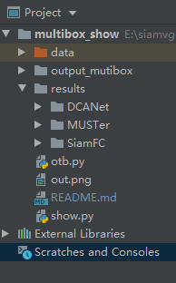
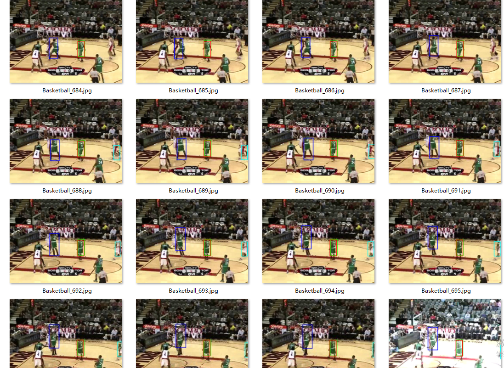

将txt或者json格式box  转化为一图多跟踪框显示

将下载的results文件放进目录,并创建一个空目录output_mutibox
[百度云链接](https://pan.baidu.com/s/1v968rtAMBKPhIpFct7-JbA )  提取码：cjcp 

格式如下：(data里面为OTB2015数据集)



修改
```python
#show.py 中 src指向OTB2015数据集所在的位置
def view_result(record):
    src="data"
```
然后执行
```python
python show.py
```
图片结果自动存储到output_mutibox中，效果图如下


默认数据库为OTB2015，在results和show.py修改即可更换跟踪器。